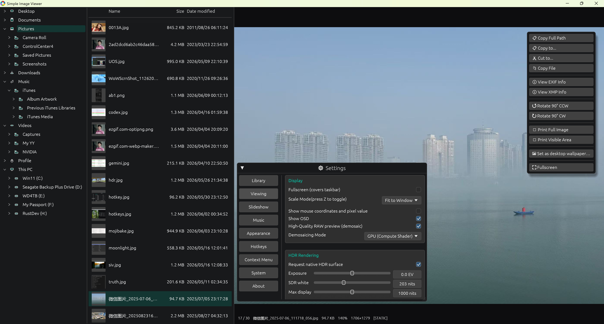

# Simple Image Viewer (SimpleImageViewer)

基于 Rust 和 [egui](https://github.com/emilk/egui) 构建的高性能跨平台图片查看器。专为快速浏览大型图片库而设计，配备简洁的深色界面、后台音乐播放功能，以及持久化设置。
 


---

## 功能概要

Simple Image Viewer 是一款轻量、快速的桌面图片查看器。它在后台预加载相邻图片以实现即时翻页，支持自动幻灯片播放，并可在查看图片的同时播放背景音乐。所有用户设置均自动保存到磁盘，下次启动时自动恢复上次的图片目录和音乐。

---

## 特性列表

- **快速图片加载** — 后台线程预加载前后图片，翻页无延迟
- **广泛格式支持** — JPEG、PNG、GIF、BMP、TIFF、TGA、WebP、ICO、PNM、HDR、AVIF、HEIF/HEIC、QOI、EXR、PSD、PSB
- **超大图分片渲染** — 内置分片渲染引擎，支持超高分辨率图片（1亿像素以上）；仅将视口内的切片上传至 GPU，通过 LRU 缓存管理保持显存占用恒定
- **PSD / PSB 支持** — 原生 Photoshop 文件读取器；PSB 大文件格式（4 GB+）通过自研流式解析器解码，加载前自动检测系统可用内存
- **HEIF / HEIC 支持** — 原生支持 iPhone 高效率图片格式；采用纯 Rust 解码方案，无复杂 C++ 依赖，跨平台兼容性好
- **Windows 系统集成** — 在设置面板中可一键注册为 Windows「打开方式」菜单中的推荐图片查看器（无需管理员权限）。提供「关联格式」对话框选择需要关联的文件类型，以及「删除关联」一键清除所有注册表项、还原为绿色软件状态
- **动画图片播放** — 自动播放 GIF 动图、APNG 和 WebP 动画，帧间延迟精确还原
- **流畅导航** — 方向键翻页、鼠标滚轮缩放、1:1 模式下拖拽平移
- **两种缩放模式** — *适应窗口*（默认）和*原始尺寸（1:1）*；按 `Z` 切换
- **EXIF & XMP 元数据查看** — 右键点击图片可查看详细的 EXIF 信息或 XMP 属性；针对常用标签（创作者、版权、工具等）进行了平铺化显示优化
- **模态对话框交互** — 元数据窗口、转到、关联设置等对话框升级为“真·模态”；开启时自动暗化背景并拦截底层交互，提供沉浸式操作体验
- **无干扰模式 (OSD)** — 可以在设置中隐藏全部悬浮文字（如图片名、缩放比例等），体验纯净看图
- **记忆播放历史** — 选项支持记忆上次关闭时查看的图片，下次启动后自动从该图开始浏览
- **自动播放幻灯片** — 间隔时间可设置（0.5 秒 – 1 小时），支持循环/到末尾停止
- **背景音乐播放** — 通过 [rodio](https://github.com/RustAudio/rodio) 支持 MP3、FLAC、OGG、WAV、AAC、M4A；可选择单个文件或整个文件夹（递归搜索）
- **曲目状态显示** — 在设置面板实时显示当前正在播放的背景音乐文件名
- **实时音量调节** — 设置面板内提供滑动条，音量在会话间持久保存
- **递归目录扫描** — 可选扫描所有子文件夹中的图片
- **设置桌面壁纸**：右键点击任何图片即可将其设置为壁纸，支持多种布局模式（填充、适应、拉伸、平铺、居中、跨显示器）。
- **氛围感转场动画**：提供多种专业的双纹理过渡效果，包括 **Cross-Fade (淡入淡出)**、**Zoom & Fade (缩放淡入)**、**Slide (滑入)**、**Push (推入)**、**Page Flip (翻页)**、**Ripple (水纹扩散)** 以及 **Curtain (拉幕)**。支持 50ms 到 2000ms 的时长调节。
- **持久化设置** — 所有偏好设置保存到可执行文件旁边的 `siv_settings.yaml`，下次启动时自动加载
- **会话恢复** — 记住上次的图片目录和音乐路径，启动时自动加载
- **全屏模式** — 按 `F11` 切换；程序始终以窗口模式启动（显示系统标题栏）
- **现代化 UI 面板** — 采用紧凑的双排分布设置面板，支持一键点击主窗口空白背景快速关闭面板
- **字体选择与大小调节** — 可从系统字体库中选择 UI 字体，并自由调节界面缩放（12–32 像素）
- **图片预加载开关** — 可选择禁用后台相邻图片预加载，以节省系统资源
- **快速跳转** — 按 `G` 键打开"跳转到图片…"对话框，直接输入序号定位任意图片
- **删除功能** — 按 `Delete` 键将当前图片放入回收站（支持跨平台），按 `Shift + Delete` 则永久删除（均不设确认对话框，方便快速整理）
- **右键上下文菜单** — 在图片上点击右键可快速复制文件完整路径，复制文件对象到剪贴板，查看 EXIF 信息，或设为桌面墙纸

---

## 操作说明

### 键盘快捷键

| 按键 / 操作 | 功能 |
|---|---|
| `→` / `↓` | 下一张图片 |
| `←` / `↑` | 上一张图片 |
| `Home` | 第一张图片 |
| `End` | 最后一张图片 |
| `+` / `-` | 放大 / 缩小 |
| `*`（或小键盘 `*`） | 重置缩放和平移 |
| 鼠标滚轮 | 缩放 |
| `空格键` | 暂停 / 继续自动播放 |
| `Z` | 切换适应窗口 ↔ 原始尺寸 |
| `G` | 打开"跳转到图片…"对话框（按序号跳转） |
| `F11` | 切换全屏 |
| `F1` / `Esc` / `鼠标左键（非面板区）` | 打开 / 关闭设置面板 |
| `鼠标右键` | 打开上下文菜单（复制路径 / 复制文件 / 查看 EXIF / 查看 XMP / 设置墙纸） |
| `Delete` | 将当前图片放入回收站 |
| `Shift + Delete` | 永久直接删除当前图片（不经回收站） |
| `Alt+F4` | 退出（Windows） |

### 使用流程

1. 启动程序，按 `F1` 打开设置面板
2. 点击 **📁 Pick** 选择图片目录（上次目录会自动恢复）
3. 扫描完成后设置面板自动关闭，使用方向键或鼠标滚轮浏览图片
4. 如需背景音乐：勾选"Play background music"，点击 **🎵 File** 或 **📂 Dir** 选择音乐文件/目录

---

## 设置面板说明（`F1`）

| 设置项 | 说明 |
|---|---|
| **Directory（目录与加载）** | 选取图片文件夹，控制递归扫描、缓存预加载以及是否恢复上次记忆的查看进度 |
| **Display（显示选项）** | 全屏切换、比例缩放模式选择，以及是否隐藏图片表层的浮动 OSD 文本 |
| **Slideshow（幻灯片播放）** | 启用自动轮播、设置间隔时间、切换循环模式 |
| **Background Music（背景音乐）** | 启用音乐、选择文件或目录、调节音量 |
| **Font & Appearance（外观）** | 选择系统字体族和界面缩放大小（拖动滑块即时生效） |
| **System Integration（系统集成）** | *（仅限 Windows）* 注册/取消注册文件类型关联，管理 Windows「打开方式」菜单中的显示 |


---

## 平台支持

| 平台 | 状态 |
|---|---|
| Windows 10/11（最低兼容 Win 8） | ✅ 主要目标平台 — 原生图标、Win32 音频 |
| macOS（Apple Silicon / Intel） | ✅ 少量改动即可编译运行 |
| Linux（X11 / Wayland） | ✅ 需要音频库（见下文） |

---

## 编译说明

### 前置条件

- [Rust](https://rustup.rs/) 1.85+（edition 2024）
- **Linux** 系统需安装音频库：
  ```bash
  sudo apt install libasound2-dev   # Debian / Ubuntu
  sudo dnf install alsa-lib-devel   # Fedora
  ```

### 编译步骤

```bash
git clone git@github.com:z16166/SimpleImageViewer.git
cd SimpleImageViewer

# 开发版本（含调试信息）
cargo run

# 发布版本（优化构建）
cargo build --release
# 输出：target/release/SimpleImageViewer（Windows 下为 SimpleImageViewer.exe）
```

### 可选：重新生成应用图标

```bash
cargo run --bin make_ico   # 将 assets/icon.jpg 转换为 assets/icon.ico
```

---

### Windows 7 x64 支持 (实验性)

如果需要编译一个能在 Windows 7 上正常运行的可执行文件，请参考以下步骤：

1.  下载 [VC-LTL-Binary.7z](https://github.com/Chuyu-Team/VC-LTL5/releases/download/v5.3.1/VC-LTL-Binary.7z)，解压到 `f:\win7\VC-LTL5`。
2.  下载 [YY-Thunks-Lib.zip](https://github.com/Chuyu-Team/YY-Thunks/releases/download/v1.2.1-Beta.2/YY-Thunks-Lib.zip) 和 [YY-Thunks-Objs.zip](https://github.com/Chuyu-Team/YY-Thunks/releases/download/v1.2.1-Beta.2/YY-Thunks-Objs.zip)，均解压到 `f:\win7\YY-Thunks`。
3.  安装 thunk-cli：
    ```powershell
    cargo install thunk-cli
    ```
4.  执行编译命令：
    ```powershell
    set VC_LTL=f:\win7\VC-LTL5
    set YY_THUNKS=f:\win7\YY-Thunks
    thunk --os win7 --arch x64 -- --release
    ```
    *注意：这样得到的 EXE 是一个控制台程序。请使用 [CFF Explorer](http://www.ntcore.com/exsuite.php) 将其子系统属性从 "Windows Console" 修改为 "Windows GUI"。*

5.  新建一个 `combase.c` 文件，内容如下：
    ```c
    #pragma comment(linker, "/export:CoTaskMemFree=ole32.CoTaskMemFree")
    ```
6.  打开 **Visual Studio x64 Native Tools Command Prompt**，执行以下命令编译得到 `combase.dll`：
    ```cmd
    cl.exe /LD combase.c /link /NODEFAULTLIB /NOENTRY /out:combase.dll
    ```
7.  将 `combase.dll` 和 `SimpleImageViewer.exe` 放在同一个目录下即可支持 Win7 x64。

*注意：如果被某些杀毒软件报毒，请忽略或添加信任。*

---

## 设置文件说明

首次运行后，`siv_settings.yaml` 会自动生成在可执行文件旁边：

```yaml
recursive: false
last_image_dir: "D:\\Photos"
auto_switch: true
auto_switch_interval: 5.0
loop_playback: true
scale_mode: fit_to_window
play_music: true
music_path: "D:\\Music"
volume: 0.8
font_family: "Microsoft YaHei"
font_size: 16.0
preload: true
```

删除该文件可将所有设置重置为默认值。

---

## 许可证

MIT — 详见 [LICENSE](LICENSE)。
