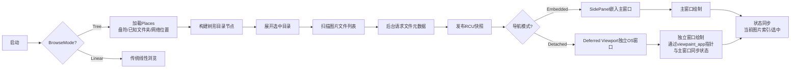
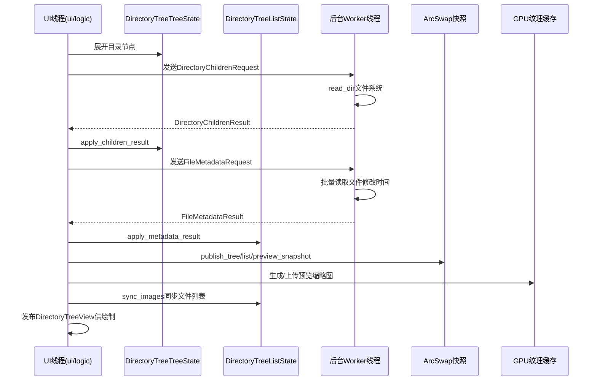

# 代码审查报告 - Round 1

**分支对比**: 当前分支 vs main  
**审查日期**: 2026-06-21  
**变更规模**: 110个文件，15254行新增，1872行删除

---

## 变更概述

### 新增功能模块
1. 树形目录窗口（directory_tree）- 支持shell对象、盘符、UNC路径
2. 图片文件列表窗口 - 支持预览图加载、点击列头排序
3. 导航窗口双模式 - Embedded（SidePanel）和 Detached（Deferred Viewport）
4. 导航窗口状态持久化 - 记录位置、最大化状态
5. 主窗口与导航窗口状态同步
6. eframe crate patch - 支持多viewport间ui()/logic()正确处理
7. rfd异步文件/目录选择对话框
8. 后台线程与UI高效数据共享（RCU快照 + ArcSwap）

### 业务流程

### 技术流程

---

## 审查问题清单

### 高优先级（建议修复）

| No. | 问题标题 | 严重性 | 建议 | 代码链接 |
|-----|----------|--------|------|----------|
| 1 | viewpaint_app裸指针在Detached模式下存在数据竞争风险 | Critical | viewpaint_app使用AtomicPtr<ImageViewerApp>在UI线程间共享裸指针。虽然注释描述了安全契约，但unsafe { (*ptr).xxx }访问多个字段时（如flush_directory_tree_strip_pending_gpu_uploads + active_modal + image_files），中间可能被其他线程打断导致读取到不一致的状态。建议将需要跨viewport访问的数据提取到独立的原子状态或snapshot中，而非依赖裸指针。 | [app.rs#L1280-L1295](file:///h:/Rust/SimpleImageViewer/src/app/directory_tree/app.rs#L1280-L1295) |
| 7 | read_file_modified_unix返回秒级时间戳但存储/显示逻辑混用毫秒 | Major | workers.rs中read_file_modified_unix返回duration.as_secs() as i64（秒级），但ui.rs中modified_unix_for_display判断> 1_000_000_000_000来区分毫秒/秒。这种隐式转换容易导致显示错误。建议统一使用毫秒或秒，并在类型层面区分（如struct UnixSeconds(i64) vs struct UnixMillis(i64)）。 | [workers.rs#L296-L303](file:///h:/Rust/SimpleImageViewer/src/app/directory_tree/workers.rs#L296-L303) |

### 中优先级

| No. | 问题标题 | 严重性 | 建议 | 代码链接 |
|-----|----------|--------|------|----------|
| 2 | read_child_directories_with_timeout中helper线程命名使用固定索引导致重名 | Major | format!("siv-dir-tree-read-dir-{helper_index}")使用READ_DIR_HELPERS_INFLIGHT的当前值作为线程名，但多个线程可能使用相同的索引值（因为CAS递增后线程退出时inflight计数下降，后续线程可能复用相同值）。这会导致调试时难以区分不同线程。建议使用原子计数器生成唯一ID。 | [workers.rs#L247-L250](file:///h:/Rust/SimpleImageViewer/src/app/directory_tree/workers.rs#L247-L250) |
| 3 | DirectoryTreeNodeArena使用u32作为arena ID但未处理删除场景 | Major | arena只支持插入和更新，不支持删除。当用户频繁切换目录时，节点只会不断累积直到达到MAX_DIRECTORY_TREE_NODES (8192)上限。虽然clear()方法存在，但只在initialize_places时调用。建议实现节点淘汰机制或在切换目录时清理旧节点。 | [node_store.rs#L72-L92](file:///h:/Rust/SimpleImageViewer/src/app/directory_tree/node_store.rs#L72-L92) |
| 8 | apply_directory_tree_image_list_sort中permute操作可能导致状态不一致 | Major | 排序操作会重排image_files数组和多个缓存，但如果中间发生panic或early return，可能导致current_index与实际文件不匹配。建议将重排操作封装为事务性操作，确保要么全部成功要么全部回滚。 | [app.rs#L520-L560](file:///h:/Rust/SimpleImageViewer/src/app/directory_tree/app.rs#L520-L560) |
| 11 | send_worker_result中try_send重试循环使用sleep(2ms)可能阻塞worker线程 | Major | 当结果channel满时，worker线程会在send_worker_result中循环重试，每次sleep 2ms。如果UI线程长时间不消费结果（如被其他操作阻塞），worker线程会持续占用CPU。建议使用recv_timeout的channel或增加退避策略。 | [workers.rs#L40-L56](file:///h:/Rust/SimpleImageViewer/src/app/directory_tree/workers.rs#L40-L56) |
| 12 | ensure_strip_worker_com_initialized在每次cold strip生成时都调用COM初始化 | Major | Windows上每个cold strip worker线程都会调用CoInitializeEx，但COM初始化是线程级别的，同一线程多次调用虽然返回RPC_E_CHANGED_MODE但仍有开销。建议使用thread_local!标记已初始化状态。 | [workers.rs#L306-L317](file:///h:/Rust/SimpleImageViewer/src/app/directory_tree/workers.rs#L306-L317) |

### 低优先级

| No. | 问题标题 | 严重性 | 建议 | 代码链接 |
|-----|----------|--------|------|----------|
| 4 | share_image_rows中debug_assert!在生产构建中被跳过 | Minor | debug_assert!(shared.as_slice() == rows, ...)在生产构建中不会执行，如果前缀共享逻辑有bug，会导致数据不一致但不会被检测到。建议改为#[cfg(debug_assertions)]条件编译的日志警告，或者使用assert!确保生产环境也能捕获。 | [domains.rs#L230-L235](file:///h:/Rust/SimpleImageViewer/src/app/directory_tree/domains.rs#L230-L235) |
| 5 | directory_tree/ui.rs文件接近2000行限制 | Minor | ui.rs文件包含大量绘制函数（1653行），接近2000行限制。建议将图像列表绘制、文件夹树绘制、列布局等拆分为独立模块文件。 | [ui.rs](file:///h:/Rust/SimpleImageViewer/src/app/directory_tree/ui.rs) |
| 6 | modified_unix_for_display中硬编码阈值1_000_000_000_000 | Minor | 该魔法数字用于判断时间戳是毫秒还是秒，但没有命名常量说明其含义。建议定义为MILLISECONDS_THRESHOLD或类似名称的常量。 | [ui.rs#L33-L38](file:///h:/Rust/SimpleImageViewer/src/app/directory_tree/ui.rs#L33-L38) |
| 9 | DirectoryTreeStripCache::evict_if_needed中LRU淘汰后revision bump可能导致不必要的重绘 | Minor | 每次淘汰都会bump_gpu_revision()，即使淘汰的是不可见的条目。这会导致publish_preview_snapshot检测到revision变化并触发重绘。建议只在淘汰了可见范围内的条目时才bump revision。 | [directory_tree_strip_cache.rs#L338-L356](file:///h:/Rust/SimpleImageViewer/src/app/directory_tree_strip_cache.rs#L338-L356) |
| 10 | logic_shared中run_directory_tree_logic_updates被多次调用 | Minor | 在logic_shared中，run_directory_tree_logic_updates被调用了2次（一次在扫描后，一次在tree select后）。虽然注释解释了原因，但多次调用可能导致重复的places加载请求或strip生成请求。建议确保内部有幂等保护。 | [logic_update.rs#L230-L240](file:///h:/Rust/SimpleImageViewer/src/app/logic_update.rs#L230-L240) |
| 13 | MAX_DIRECTORY_TREE_NODES硬编码为8192但无配置选项 | Minor | 对于有大量子目录的场景（如照片库有数千个文件夹），8192节点上限可能不够。建议在settings中提供可配置选项，或至少根据内存动态计算。 | [mod.rs#L32](file:///h:/Rust/SimpleImageViewer/src/app/directory_tree/mod.rs#L32) |
| 14 | DirectoryTreePublishContext中preview_textures和preview_logical_sizes的Option传递方式容易遗漏 | Minor | publish_domain_snapshots需要同时传入preview_cache_revision、preview_textures、preview_logical_sizes三个Option，如果只传了其中一两个会导致预览不更新。建议封装为单一结构体。 | [domains.rs#L370-L395](file:///h:/Rust/SimpleImageViewer/src/app/directory_tree/domains.rs#L370-L395) |

---

## 审查规范对照检查

### 已通过的检查项

- **检查点1**: 新增常量均有命名（如MAX_DIRECTORY_TREE_NODES、DIRECTORY_TREE_WORKER_CHANNEL_BOUND等）
- **检查点3**: ui()和logic()中无同步耗时操作，磁盘I/O已移至后台worker
- **检查点4**: 用户可见字符串已做i18n支持（使用rust_i18n::t!()）
- **检查点5**: 后台线程数量可控，有shutdown机制
- **检查点7**: 资源管理使用RAII（ReadDirPathGuard、InflightGuard等）
- **检查点8**: 缓存有明确上限（DIRECTORY_TREE_STRIP_CACHE_MAX=128）
- **检查点9**: 调试日志使用preload_debug!条件编译
- **检查点10**: generation匹配处理正确，有stale generation检测
- **检查点12**: 新增文件已按特性拆分为多个rs文件
- **检查点13**: 新增*.rs文件头部有GPLv3版权文字
- **检查点15**: 错误有统一传播（通过status_message和log）
- **检查点16**: 有Windows/macOS/Linux/Unix平台条件编译
- **检查点22**: 预览图使用Arc<[DirectoryTreeFileRow]>共享，避免clone
- **检查点28**: 文件路径使用PathBuf/UTF-8传递
- **检查点32**: channel通信有超时（DIRECTORY_TREE_READ_DIR_TIMEOUT、FOLDER_PICKER_TIMEOUT等）
- **检查点33**: 使用parking_lot::Mutex

### 需要注意的检查项

- **检查点6**: 问题1涉及的viewpaint_app裸指针访问存在潜在的race condition
- **检查点18**: 部分函数嵌套层数较深（如draw_directory_tree_top_panels），但尚在可接受范围
- **检查点19**: 部分阈值处理缺少注释说明（如modified_unix_for_display的阈值判断）

---

## 总结

本次变更引入了完整的树形目录导航功能，架构设计合理：
- 采用RCU（ArcSwap）模式实现UI线程无锁读取
- 后台worker线程处理文件系统I/O
- Embedded/Detached双模式设计灵活
- eframe patch解决了多viewport下logic()调用问题

主要风险集中在：
1. **问题1**的裸指针安全性 - 需要重点审查
2. **问题7**的时间戳单位一致性 - 影响用户可见的正确性
3. **问题3**的arena节点累积 - 长期使用可能导致性能下降
