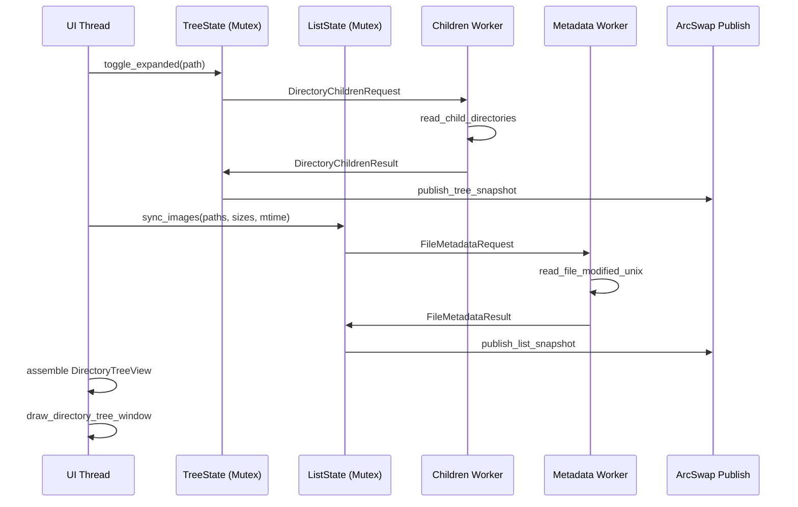

# Code Review: Directory Tree Navigation Window (ISSUE-19/17)

**Review Scope:** Current branch vs `main` branch
**Reviewer:** Trae AI (Round 1)
**Date:** 2026-06-20

---

## Change Overview

**Author's Intent:** Add a navigation window comprising a directory tree panel and an image file list panel, supporting both Embedded (SidePanel) and Detached (deferred viewport) modes, with window placement persistence, shell object/UNC/drive support, preview thumbnails, sortable columns, and efficient background-thread UI data sharing.

### Business Flow

### Technical Flow

---

## Review Findings

| No. | Issue Title | Severity | Suggestion | Code Link |
|-----|-------------|----------|------------|-----------|
| 1 | `extract_tile` silently ignores `CopyPixels` failure | Major | Log the error or propagate failure indication | [wic/tiled_source.rs#L185](file:///h:/Rust/SimpleImageViewer/src/wic/tiled_source.rs#L185) |
| 2 | `strip_worker_com_initialized` has side-effect of initializing COM | Major | Rename or refactor to avoid side-effect; document behavior | [directory_tree/workers.rs#L259](file:///h:/Rust/SimpleImageViewer/src/app/directory_tree/workers.rs#L259) |
| 3 | Orphan threads on `read_dir` timeout are not truly cancelled | Major | Document limitation clearly; consider adding cancellation token | [directory_tree/workers.rs#L198](file:///h:/Rust/SimpleImageViewer/src/app/directory_tree/workers.rs#L198) |
| 4 | `viewpaint_app` raw pointer stored in `AtomicPtr` without safety docs | Major | Add safety documentation for the AtomicPtr usage contract | [directory_tree/mod.rs#L308](file:///h:/Rust/SimpleImageViewer/src/app/directory_tree/mod.rs#L308) |
| 5 | `#[cfg(windows)]` vs `#[cfg(target_os = "windows")]` inconsistency | Minor | Standardize on `#[cfg(target_os = "windows")]` throughout | [directory_tree/ui.rs#L1493](file:///h:/Rust/SimpleImageViewer/src/app/directory_tree/ui.rs#L1493) |
| 6 | `DirectoryTreeNodeArena` uses `u32` ID — overflow panic possible | Minor | Add assertion or use `usize` for IDs; cap is 8192 so low risk | [directory_tree/node_store.rs#L58](file:///h:/Rust/SimpleImageViewer/src/app/directory_tree/node_store.rs#L58) |
| 7 | `share_image_rows` prefix-sharing logic may share stale data | Minor | Add debug_assert to verify shared prefix integrity | [directory_tree/domains.rs#L246](file:///h:/Rust/SimpleImageViewer/src/app/directory_tree/domains.rs#L246) |
| 8 | `READ_DIR_HELPERS_INFLIGHT` uses `Relaxed` ordering | Minor | Consider `Acquire`/`Release` for correctness on weakly-ordered CPUs | [directory_tree/workers.rs#L152](file:///h:/Rust/SimpleImageViewer/src/app/directory_tree/workers.rs#L152) |
| 9 | `generate_preview_internal` aspect mismatch fallback lacks logging clarity | Minor | Add debug log when falling through to scaler path | [wic/tiled_source.rs#L267](file:///h:/Rust/SimpleImageViewer/src/wic/tiled_source.rs#L267) |
| 10 | `DirectoryTreePublishContext` holds mutable refs to both tree and list | Minor | Consider splitting publish into two independent calls | [directory_tree/domains.rs#L375](file:///h:/Rust/SimpleImageViewer/src/app/directory_tree/domains.rs#L375) |
| 11 | `invalidate_directory_tree_strip_after_image_list_reorder` clears all caches aggressively | Minor | Consider incremental invalidation for better performance | [directory_tree/strip_previews.rs#L781](file:///h:/Rust/SimpleImageViewer/src/app/directory_tree/strip_previews.rs#L781) |
| 12 | `evict_if_needed` is O(n) per insert — acceptable at cap=128 but fragile | Minor | Document that raising cap requires LRU structure | [directory_tree_strip_cache.rs#L249](file:///h:/Rust/SimpleImageViewer/src/app/directory_tree_strip_cache.rs#L249) |

---

## Detailed Findings

### Issue 1: `extract_tile` silently ignores `CopyPixels` failure

**File:** [src/wic/tiled_source.rs](file:///h:/Rust/SimpleImageViewer/src/wic/tiled_source.rs#L180-L190)

The `extract_tile` method calls `converter.CopyPixels(...)` and discards the `Result` with `let _ =`. If `CopyPixels` fails, the tile will be all zeros (black), and no diagnostic is logged. This makes debugging tile rendering issues difficult.

**Suggestion:** Add a `log::warn!` when `CopyPixels` fails, similar to how other WIC paths log failures.

---

### Issue 2: `strip_worker_com_initialized` has side-effect of initializing COM

**File:** [src/app/directory_tree/workers.rs](file:///h:/Rust/SimpleImageViewer/src/app/directory_tree/workers.rs#L259-L269)

The function name suggests it's a predicate (`...initialized() -> bool`), but it actually calls `CoInitializeEx` which **initializes COM** as a side effect. This is misleading and could cause issues if someone calls it thinking it's a pure check.

**Suggestion:** Rename to `ensure_strip_worker_com_initialized()` or similar to make the side-effect explicit. Alternatively, split into a pure check (`is_com_initialized`) and an init function.

---

### Issue 3: Orphan threads on `read_dir` timeout are not truly cancelled

**File:** [src/app/directory_tree/workers.rs](file:///h:/Rust/SimpleImageViewer/src/app/directory_tree/workers.rs#L185-L210)

When `read_dir` times out (30s), the spawned thread continues running until the OS `read_dir` call returns. The `orphan_flag` only recycles the inflight counter — it doesn't stop the thread. On slow/offline network paths, up to `MAX_READ_DIR_HELPERS_INFLIGHT` (4) orphan threads may linger indefinitely.

The code comment acknowledges this tradeoff, but the risk should be documented at the module level since users browsing network shares may experience thread accumulation.

**Suggestion:** Consider using `tokio::fs::read_dir` with a timeout, or document the thread accumulation risk in the module docs.

---

### Issue 4: `viewpaint_app` raw pointer stored in `AtomicPtr` without safety docs

**File:** [src/app/directory_tree/mod.rs](file:///h:/Rust/SimpleImageViewer/src/app/directory_tree/mod.rs#L308)

The `viewpaint_app: Arc<AtomicPtr<ImageViewerApp>>` field stores a raw pointer to `ImageViewerApp`. The pointer is set to non-null during viewport paint and cleared to `null_mut()` afterward. There are no safety comments explaining:
- Who sets the pointer and when
- What guarantees the pointer is valid when read
- Thread-safety of the pointer lifecycle

**Suggestion:** Add a `/// # Safety` comment block explaining the AtomicPtr usage contract, or replace with a safer mechanism (e.g., a channel or Arc-based approach).

---

### Issue 5: `#[cfg(windows)]` vs `#[cfg(target_os = "windows")]` inconsistency

**File:** [src/app/directory_tree/ui.rs](file:///h:/Rust/SimpleImageViewer/src/app/directory_tree/ui.rs#L1493)

The codebase uses both `#[cfg(windows)]` (family check) and `#[cfg(target_os = "windows")]` (OS check). While they produce the same result on Windows, they are semantically different — `windows` family includes UWP targets. The rest of the codebase consistently uses `target_os = "windows"`.

**Suggestion:** Change `#[cfg(windows)]` to `#[cfg(target_os = "windows")]` for consistency.

---

### Issue 6: `DirectoryTreeNodeArena` uses `u32` ID — overflow panic possible

**File:** [src/app/directory_tree/node_store.rs](file:///h:/Rust/SimpleImageViewer/src/app/directory_tree/node_store.rs#L58)

The `insert` and `or_insert_with` methods use `u32::try_from(self.entries.len()).expect("directory tree node arena overflow")`. While `MAX_DIRECTORY_TREE_NODES` (8192) caps the total nodes, the arena itself doesn't enforce this cap — it's enforced in `apply_children_result`. If a bug bypasses that check, the arena will panic at 4 billion nodes.

**Suggestion:** Low risk given the 8192 cap, but consider using `usize` for IDs to eliminate the panic path entirely.

---

### Issue 7: `share_image_rows` prefix-sharing logic may share stale data

**File:** [src/app/directory_tree/domains.rs](file:///h:/Rust/SimpleImageViewer/src/app/directory_tree/domains.rs#L246-L256)

The `share_image_rows` function attempts to reuse the previous `Arc<[DirectoryTreeFileRow]>` when the new rows are a prefix extension of the old ones. The check `rows.get(0..prev_len) == Some(previous.as_ref())` compares slices, but if the previous Arc was shared with other snapshots, modifying `rows` after the check could cause subtle issues.

**Suggestion:** Add a `debug_assert` to verify the shared prefix is valid, or document the sharing invariant.

---

### Issue 8: `READ_DIR_HELPERS_INFLIGHT` uses `Relaxed` ordering

**File:** [src/app/directory_tree/workers.rs](file:///h:/Rust/SimpleImageViewer/src/app/directory_tree/workers.rs#L152)

The atomic counter for inflight `read_dir` helpers uses `Relaxed` ordering for both the load and the `compare_exchange`. While this is likely correct for a simple counter on x86 (which has strong memory ordering), on ARM/NEON systems the `Relaxed` ordering could theoretically cause the counter to appear inconsistent across threads.

**Suggestion:** Consider using `Acquire` for loads and `Release` for stores to ensure correctness on all architectures.

---

### Issue 9: `generate_preview_internal` aspect mismatch fallback lacks logging clarity

**File:** [src/wic/tiled_source.rs](file:///h:/Rust/SimpleImageViewer/src/wic/tiled_source.rs#L267-L276)

When `preview_aspect_matches_logical` returns false after a successful Native Source Transform, the code falls through to the scaler path. The debug log explains the skip, but it's easy to miss during debugging.

**Suggestion:** Consider adding a metric or more prominent log when aspect mismatches occur frequently, as this indicates a performance degradation (falling back to slower scaler).

---

### Issue 10: `DirectoryTreePublishContext` holds mutable refs to both tree and list

**File:** [src/app/directory_tree/domains.rs](file:///h:/Rust/SimpleImageViewer/src/app/directory_tree/domains.rs#L375-L385)

The `DirectoryTreePublishContext` struct holds `&mut` references to both `tree` and `list` state simultaneously. This prevents independent publishing of tree and list snapshots and couples their lifetimes unnecessarily.

**Suggestion:** Consider splitting `publish_domain_snapshots` into two independent functions (`publish_tree` and `publish_list`) that can be called separately.

---

### Issue 11: `invalidate_directory_tree_strip_after_image_list_reorder` clears all caches aggressively

**File:** [src/app/directory_tree/strip_previews.rs](file:///h:/Rust/SimpleImageViewer/src/app/directory_tree/strip_previews.rs#L781-L791)

When the image list is reordered, this function clears ALL strip preview caches, inflight sets, and the preview snapshot. For large image lists (thousands of images), this means all cached thumbnails are discarded and must be regenerated.

**Suggestion:** Consider relocating cache entries instead of clearing them entirely (the `DirectoryTreeStripCache::permute` method already exists for this purpose).

---

### Issue 12: `evict_if_needed` is O(n) per insert — acceptable at cap=128 but fragile

**File:** [src/app/directory_tree_strip_cache.rs](file:///h:/Rust/SimpleImageViewer/src/app/directory_tree_strip_cache.rs#L249-L270)

The eviction function scans all cached indices to find the farthest neighbor. At `DIRECTORY_TREE_STRIP_CACHE_MAX = 128`, this is cheap, but the const comment warns that raising the cap requires an LRU structure.

**Suggestion:** The existing comment is adequate. No action needed unless the cap is raised.

---

## Positive Observations

1. **RCU-style publish pattern** — The use of `ArcSwap` for snapshot publishing is well-implemented and provides lock-free reads from the UI thread.

2. **Request coalescing** — The `coalesce_children_requests` and `coalesce_metadata_requests` functions efficiently batch filesystem operations.

3. **Generation-based staleness detection** — Using generation counters to detect stale results is a clean approach to avoid race conditions.

4. **Preview aspect validation** — The `preview_aspect_matches_logical` checks prevent displaying incorrectly-cropped thumbnails.

5. **Cold thumbnail prioritization** — The `collect_cold_strip_thumbnail_candidates` function prioritizes the current image and visible rows before neighbors, which is a good UX decision.

6. **COM initialization handling** — The `ComGuard` properly handles `RPC_E_CHANGED_MODE` and `S_FALSE` return codes from `CoInitializeEx`.

7. **Cross-platform volume root detection** — The `volume_root_for_path` function correctly handles Windows drive letters, macOS `/Volumes`, and Linux `/media`/`/mnt` paths.
